# ENUMERATION REPORT

---

## TARGET IP: 192.162.56.106

---
## SECTION A - BASIC ENUMERATION
---

## 1. Challenge 1 - Netbios Enumeration <br>

```
nbtstat -a 192.168.56.106
```

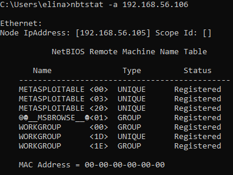

### Findings: <br>

Hostname: METASPLOITABLE <br>
Workgroup: WORKGROUP <br>
Messenger Service: METASPLOITABLE <br>
File Server Service: METASPLOITABLE

---

## 2. Challenge 2 - Fast Nmap Scan <br>

```
nmap -F 192.168.56.106
```

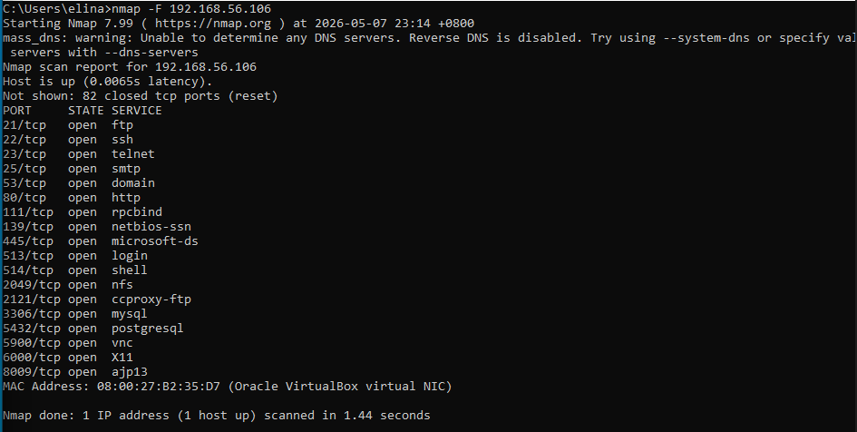

### Findings: <br>

Port 21 – FTP <br>
Port 22 – SSH <br>
Port 23 – Telnet <br>
Port 25 – SMTP <br>
Port 80 – HTTP <br>
Port 111 - RPCBIND <br>
Port 139 – NETBIOS-SSN <br>
Port 445 – MICROSOFT-DS <br>
Port 513 – LOGIN <br>
Port 514 - SHELL <br>
Port 2049 – NFS <br>
Port 2121 – CCPROXY-FTP <br>
Port 3306 – MYSQL <br>
Port 5432 - POSTGRESQL <br>
Port 5900 – VNC <br>
Port 6000 – X11

---

## 3. Challenge 3 - DNS Records

```
nslookup google.com
```

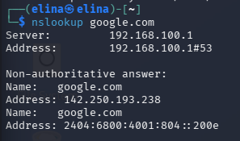

### Findings: <br>

A Record: 142.250.193.238 <br>
AAAA Record: 2404:6800:4001:804:200e

---

```
dig ANY  google.com
```

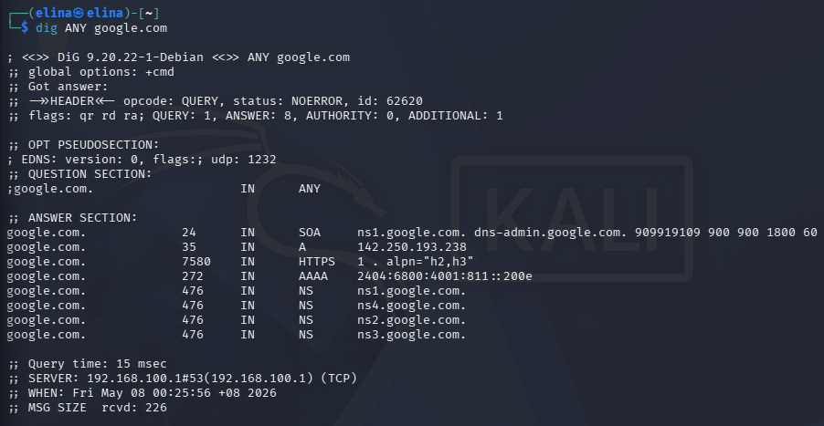

### Findings: <br>

AAAA Record: 2404:6800:4001:804:200e <br>
NS Records: 
* ns1.google.com.
* ns2.google.com.
* ns3.google.com.
* ns4.google.com.

---

```
dig MX  google.com
```

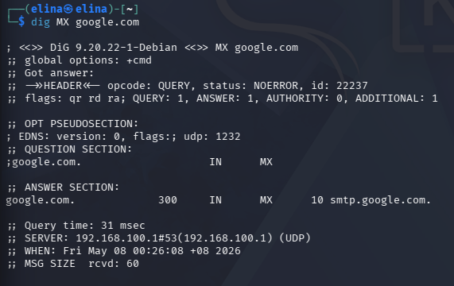

### Findings: <br>

MX Record: 10 smtp.google.com.

---

## 4. Challenge 4 - SNMPwalk

```
snmpwalk -v1 -c public 192.168.56.106
```

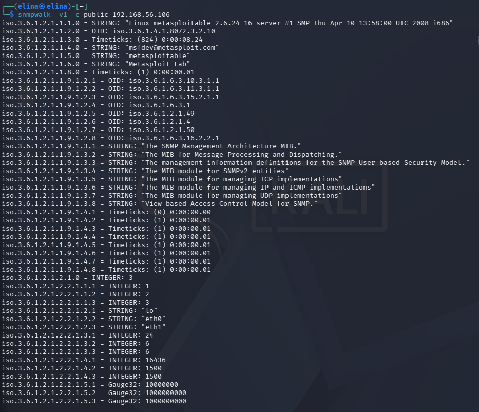
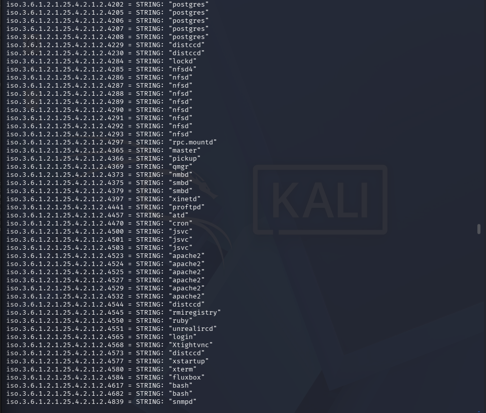

### Findings: <br>

sysDescr: Linux metasploitable 2.6.24-16-server #1 SMP Thu Apr 10 13:58:00 UTC 2008 i686 <br>
sysName: metasploitable <br>
System Uptime: (824) 0:00:08.24 <br>
Network Interfaces: lo, eth0, eth1 <br>
Running Processes: postgres, nfsd, smbd, apache2, mysql, snmpd, bash

---

## 5. Challenge 5 - TTL OS Fingerprinting

```
ping -C 2 192.168.56.106
```

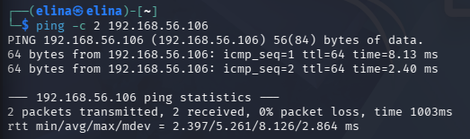

### Findings: <br>

Reply from 192.168.56.106: ttl=64 -> Linux

---

## 6. Challenge 6 - Anonymous LDAP Query

```
ldapsearch -x -H ldap://<IP> -b "dc=metasploitable,dc=local"
```

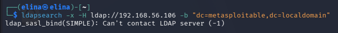

### Findings: <br>

Not Allowed / Service Inactive

---

## 7. Challenge 7 - SMTP, VRFY / EXPN

```
nc 192.168.56.106 25
VRFY root
EXPN admin
```

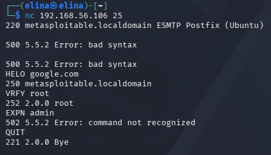

### Findings: <br>

Target Banner: 220 metasploitable.localdomain ESMTP Postfiz (Ubuntu) – Leaked OS/Service Info <br>
VRFY root: 252 2.0.0 root – Weak (Valid User Found) <br>
EXPN admin: 502 5.5.2 Error: command not recognized – Disabled / Hardened

---

## 8. Challenge 9 - FTP Banner

```
nc 192.168.56.106 21
```

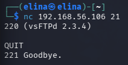

### Findings: <br>

Full Banner Response: 220 (vsFTPd 2.3.4)

---

## 9. Challenge 10 - Anonymous FTP Login

```
ftp 192.168.56.106 
```

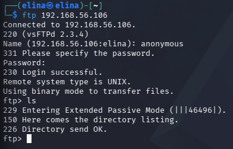

### Findings: <br>

Login Credential: Username: anonymous <br>
Password Used: Blank / No password <br>
Login Status: 230 Login successful <br>
Remote OS Type: Remote system type is UNIX <br>
Directory Access: 226 Directory send OK

---

## SECTION B - INTERMEDIATE ENUMERATION

---

## 10. Challenge 11 - SMB NSE Enumeration

```
nmap --script smb-os-discovery -p445 192.168.56.106 
```

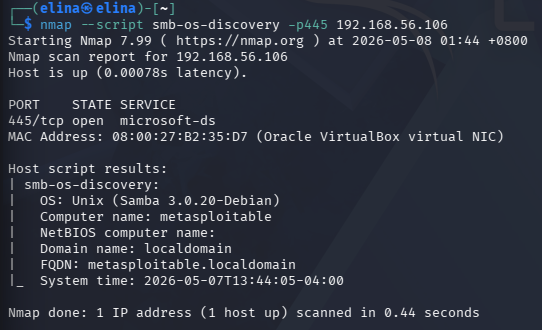

```
nmap --script smb-enum-users -p445  192.168.56.106 
```
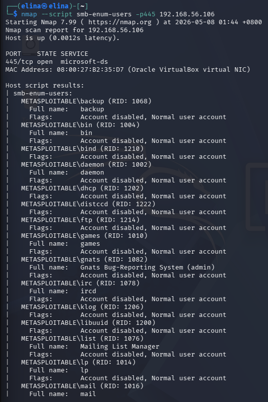

### Findings: <br>

OS / Samba Version: Samba 3.0.20-Debian <br>
Domain/Workgroup: localdomain <br>
List of Users: 
* backup
* bin
* daemon
* games
* Gnats Bug-Reporting System (admin)
* ircd
* Mailing List Manager
* lp
* mail
* etc

---

## 11. Challenge 12 - Enum4linux

```
enum4linux -a 192.168.56.106 
```

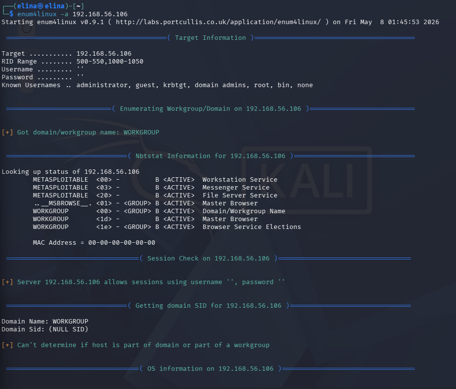
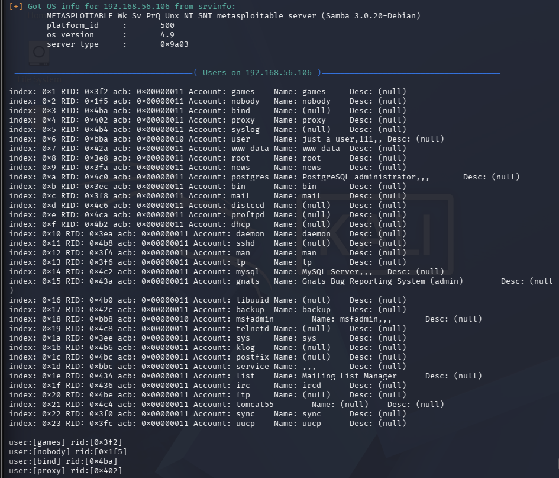
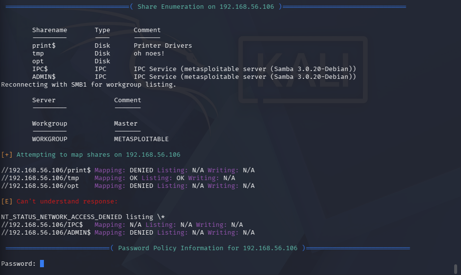

### Findings: <br>

NetBIOS Info: Name: METASPLOITABLE Workgroup: WORKGROUP, MAC: 00-00-00-00-00-00 <br>
Users: games, nobody, bind, proxy, syslog, user, www-data, root, msfadmin, etc <br>
Groups: Domain Admins, Domain Users, Domain Guests <br>
SMB Shares: print$, tmp, opt, IPC$, ADMIN$ 

---

## 12. Challenge 13 - NFS Exports

```
showmount -e 192.168.56.106 
```

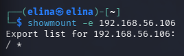

### Findings: <br>

/* - High Risk because the entire root directory (/) is exported to everyone (*)

---

## 13. Challenge 14 - SNMP NSE

```
nmap -sU -p161 --script=snmp-sysdescr 192.168.56.106 
```

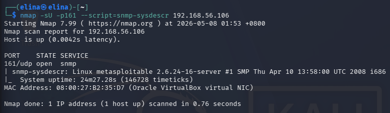

```
nmap -sU -p161 --script=snmp-processes 192.168.56.106 
```

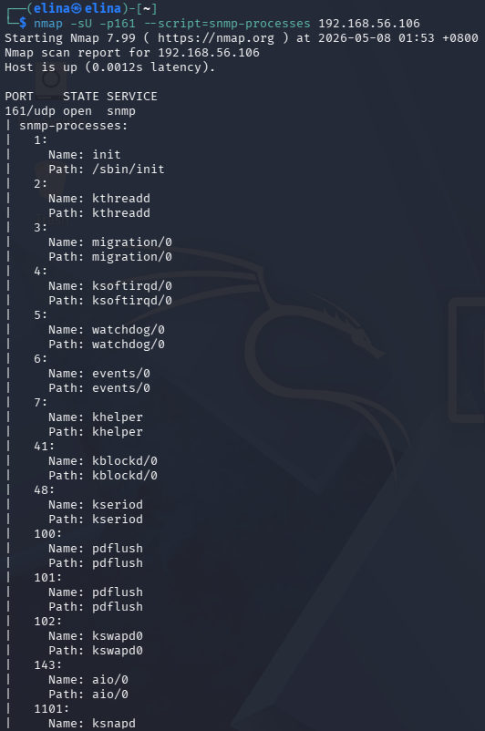

### Findings: <br>

Finding:
OS Description: Linux metasploitable 2.6.24-16-server #1 SMP Thu Apr 10 13:58:00 UTC 2008 i686 – Linux 2.6.x Kernel <br>
Running Services: init, kthreadd, migration/0, ksoftirqd/0, watchdog/0, events/0, khelper – System and Kernal Processes <br>
Extended Services: kblockd/0, kseriod, pdflush, kswap0, aio/0, ksnapd – I/O and Memory Management

---

## 14. Challenge 15 - Version Detection

```
nmap -sV 192.168.56.106 
```

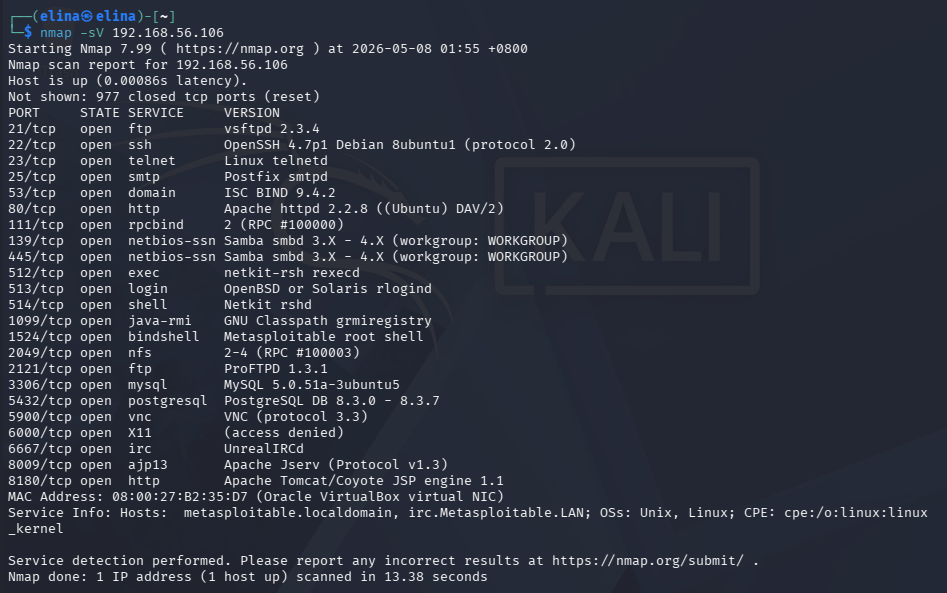

### Findings: <br>

SSH – OpenSSH 4.7P1 <br>
HTTP – Apache httpd 2.2.8 <br>
FTP – vsFTPd 2.3.4 <br>
SQL (MySQL) – MySQL 5.0.51a-3ubuntu5 <br>
SQL (Postgres) – PostgresSQL DB 8.3.0 – 8.3.7

---

## 15. Challenge 17 - OS Detection

```
nmap -O 192.168.56.106 
```

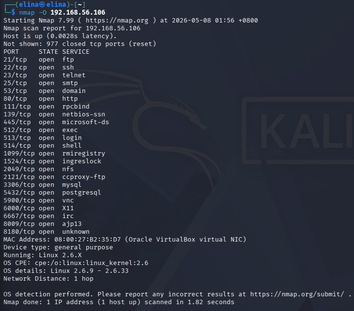

### Findings: <br>

OS Details: Linux 2.6.9 – 2.6.33 <br>
CPE: cpe:/o:linux:linux_kernel:2.6

---

## 16. Challenge 19 - RPC Info

```
rpcinfo -p 192.168.56.106 
```

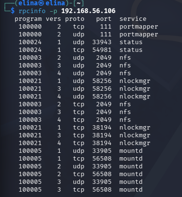

### Findings: <br>

* portmapper – Port 111(tcp/udp)
* mountd – Port 56508/33905 (tcp/udp)
* nfs – Port 2049 (tcp/udp)
* status – Port 54981/33943 (status)

---
## SECTION C - ADVANCED ENUMERATION
---

## 17. Challenge 22 - Correlation Table

| Source | Operating System | FTP Service | HTTP Service | SMB / Samba | RCP / NFS | SQL Database |
| :--- | :--- | :--- | :--- | :--- | :--- | :--- |
| **NMAP** | Linux 2.6.x | Port 21: vsFTPd 2.3.4 | Port 80: Apache 2.2.8 | Port 445: netbios-ssn | Port 111 & 2049 | Port 3306: MySQL |
| **SNMP** | Linux 2.4.24-16-server | Not in process list | Process: apache2 | Process: smbd/nmbd | Process: nfsd | Process: mysqld |
| **Other** | TTL = 64 (Linux) | Banner: vsFTPd 2.3.4 | Banner: Apache/2.2.8 (Ubuntu) | enum4linux: Samba 3.0.20 | showmount: /* | Version: 5.0.51a-3 |
| **Conclusion** | **Linux Metasploitable 2** | **vsFTPd 2.3.4(Vulnerable)** | **Apache 2.2.8** | **Samba 3.0.20-Debian** | **NFS Root Share** | **MySQL Exposed** |
